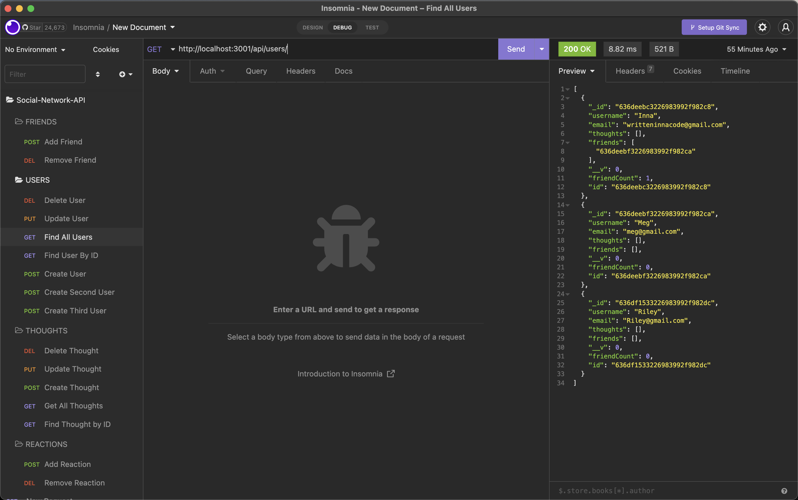

# NoSQL Social Network API

💻 [The repo can be found here.](https://github.com/WrittenInnaCode/NoSQL-Social-Network-API)

📺 [Check out the walkthough video here.](https://drive.google.com/file/d/1IeaFde_St-HmyzQXNt0L5Cqrf2JxQpsQ/view)
<br/><br/>

## Table of Contents:
* [Description](#description)
* [Technology](#technology)
* [Installation](#installation)
* [Screenshot](#screenshot)
* [Contributor](#contributor)
* [Questions](#questions)

<br/>

## Description
This is an API for a social network web application where users can share their thoughts, react to friends’ thoughts, and create a friend list.
<br/><br/>

## Technology

Project is created with:
<p><a href="https://www.mongodb.com/">MongoDB</a></p>
<p><a href="https://www.npmjs.com/package/mongoose">Mongoose</a></p>
<p><a href="https://nodejs.org/">Node.js</a></p>
<p><a href="https://www.npmjs.com/package/express">Express.js</a></p>
<p><a href="https://www.npmjs.com/package/dayjs">Day.js</a></p>
<br/><br/>

## Installation
To run this project, install it locally with the following command:

```Terminal Commands
npm install
 ```
<br/>

After installing npm packages, the application will be invoked by using the following command:

```
npm start
```
<br/><br/>

## Screenshot


<br/><br/>

## Contributor:
Inna Sherstnyova
<br/><br/>

## Questions:
If you have any questions, please contact me. 

📧 My email address is writteninnacode@gmail.com 

🌐 To find my GitHub page, visit [https://github.com/WrittenInnaCode](https://github.com/WrittenInnaCode)